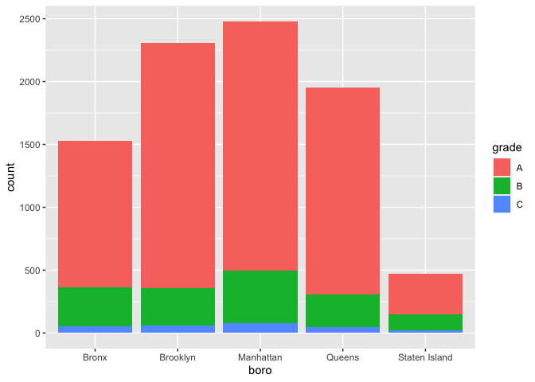
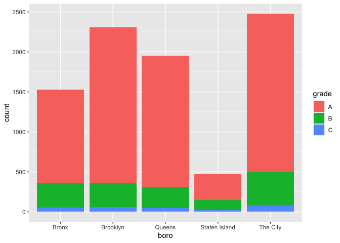
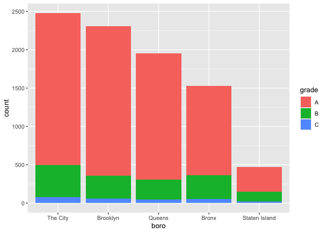

String and Factors
================
Kimberly Lopez
2024-10-15

Load libraries

``` r
library(rvest)
library(p8105.datasets)
library(stringr)
library(forcats)
library(rvest)
library(dplyr)
```

    ## 
    ## Attaching package: 'dplyr'

    ## The following objects are masked from 'package:stats':
    ## 
    ##     filter, lag

    ## The following objects are masked from 'package:base':
    ## 
    ##     intersect, setdiff, setequal, union

``` r
library(tidyverse)
```

    ## ── Attaching core tidyverse packages ──────────────────────── tidyverse 2.0.0 ──
    ## ✔ ggplot2   3.5.1     ✔ readr     2.1.5
    ## ✔ lubridate 1.9.3     ✔ tibble    3.2.1
    ## ✔ purrr     1.0.2     ✔ tidyr     1.3.1

    ## ── Conflicts ────────────────────────────────────────── tidyverse_conflicts() ──
    ## ✖ dplyr::filter()         masks stats::filter()
    ## ✖ readr::guess_encoding() masks rvest::guess_encoding()
    ## ✖ dplyr::lag()            masks stats::lag()
    ## ℹ Use the conflicted package (<http://conflicted.r-lib.org/>) to force all conflicts to become errors

# Strings and Regex

The most frequent operation involving strings is to search for an exact
match.

- use str_detect to find cases where the match exists (often useful in
  conjunction with filter) use str_replace to replace an instance of a
  match with something else (often useful in conjunction with mutate).

``` r
string_vec = c("my", "name", "is", "jeff")

str_detect(string_vec, "jeff")
```

    ## [1] FALSE FALSE FALSE  TRUE

``` r
str_replace(string_vec, "jeff","Jeff")
```

    ## [1] "my"   "name" "is"   "Jeff"

For exact matches, you can designate matches at the beginning or end of
the line.

``` r
string_vec = c(
  "i think we all rule for participating",
  "i think i have been caught",
  "i think this will be quite fun actually",
  "it will be fun, i think"
  )

str_detect(string_vec, "^i think")
```

    ## [1]  TRUE  TRUE  TRUE FALSE

``` r
str_detect(string_vec, "i think^")
```

    ## [1] FALSE FALSE FALSE FALSE

They all have the same i think” at the beginning of the line. To make it
either start and end with “i think” use the ^ at the beginning or end of
the string.

You can designate a list of characters that will count as a match.

``` r
string_vec = c(
  "Time for a Pumpkin Spice Latte!",
  "went to the #pumpkinpatch last weekend",
  "Pumpkin Pie is obviously the best pie",
  "SMASHING PUMPKINS -- LIVE IN CONCERT!!"
  )

str_detect(string_vec,"[Pp]umpkin")
```

    ## [1]  TRUE  TRUE  TRUE FALSE

To get a range of letters or numbers that count as a match: use -

``` r
string_vec = c(
  '7th inning stretch',
  '1st half soon to begin. Texas won the toss.',
  'she is 5 feet 4 inches tall',
  '3AM - cant sleep :('
  )

str_detect(string_vec, "^[0-9][a-zA-Z]")
```

    ## [1]  TRUE  TRUE FALSE  TRUE

The character . matches anything. Suppose we want to detect any
character with 7 and 11 with “.”

``` r
string_vec = c(
  'Its 7:11 in the evening',
  'want to go to 7-11?',
  'my flight is AA711',
  'NetBios: scanning ip 203.167.114.66'
  )

str_detect(string_vec, "7.11")
```

    ## [1]  TRUE  TRUE FALSE  TRUE

If your looking for a “special” charcater like: \[ \], ( ), and . You
have to indicate they are special using “". However,  is also a special
character so you have to put two \\

``` r
string_vec = c(
  'The CI is [2, 5]',
  ':-]',
  ':-[',
  'I found the answer on pages [6-7]'
  )

str_detect(string_vec, "\\[")
```

    ## [1]  TRUE FALSE  TRUE  TRUE

# Thoughts on Factors

``` r
vec_sex = factor(c("male", "male", "female", "female"))
vec_sex
```

    ## [1] male   male   female female
    ## Levels: female male

``` r
as.numeric(vec_sex)
```

    ## [1] 2 2 1 1

To relevel based on “reference” category in an analysis, you can use the
fct_relevl() function to change the underlying level structure

``` r
vec_sex = fct_relevel(vec_sex, "male")
vec_sex
```

    ## [1] male   male   female female
    ## Levels: male female

``` r
as.numeric(vec_sex)
```

    ## [1] 1 1 2 2

IN GENERAL: always recode the factor variables to the levels with the
order of the data. Anytime you are dealing with a factor use the package
forcats

# National Survey on Drug Use and Health data

revisiting example from before:

``` r
library(rvest)
library(dplyr)
library(tidyr)
```

``` r
nsduh_url = "http://samhda.s3-us-gov-west-1.amazonaws.com/s3fs-public/field-uploads/2k15StateFiles/NSDUHsaeShortTermCHG2015.htm"

table_marj = 
  read_html(nsduh_url) |> 
  html_table() |> 
  first() |>
  slice(-1)

head(table_marj)
```

    ## # A tibble: 6 × 16
    ##   State      `12+(2013-2014)` `12+(2014-2015)` `12+(P Value)` `12-17(2013-2014)`
    ##   <chr>      <chr>            <chr>            <chr>          <chr>             
    ## 1 Total U.S. 12.90a           13.36            0.002          13.28b            
    ## 2 Northeast  13.88a           14.66            0.005          13.98             
    ## 3 Midwest    12.40b           12.76            0.082          12.45             
    ## 4 South      11.24a           11.64            0.029          12.02             
    ## 5 West       15.27            15.62            0.262          15.53a            
    ## 6 Alabama    9.98             9.60             0.426          9.90              
    ## # ℹ 11 more variables: `12-17(2014-2015)` <chr>, `12-17(P Value)` <chr>,
    ## #   `18-25(2013-2014)` <chr>, `18-25(2014-2015)` <chr>, `18-25(P Value)` <chr>,
    ## #   `26+(2013-2014)` <chr>, `26+(2014-2015)` <chr>, `26+(P Value)` <chr>,
    ## #   `18+(2013-2014)` <chr>, `18+(2014-2015)` <chr>, `18+(P Value)` <chr>

Tidy the dataset:

- Need to split age variable by using seperate() splitting on the
  charcater of an open paranthesis ( ) **make sure to use \\ since ( )
  is a special character**
- and some of the values in percent need to convert to numeric
  - mutate() and str_replace() to get rid of the parenthesis
- Go from wide format to long format using pivot_longer()
- get rid of (P Value) from column names using select()

``` r
data_marj = 
  table_marj |>
  select(-contains("P Value")) |>
  pivot_longer(
    -State,
    names_to = "age_year", 
    values_to = "percent") |>
  separate(age_year, into = c("age", "year"), sep = "\\(") |>
  mutate(
    year = str_replace(year, "\\)", ""),
    percent = str_replace(percent, "[a-c]$", ""),
    percent = as.numeric(percent)) |>
  filter(!(State %in% c("Total U.S.", "Northeast", "Midwest", "South", "West")))

head(data_marj)
```

    ## # A tibble: 6 × 4
    ##   State   age   year      percent
    ##   <chr>   <chr> <chr>       <dbl>
    ## 1 Alabama 12+   2013-2014    9.98
    ## 2 Alabama 12+   2014-2015    9.6 
    ## 3 Alabama 12-17 2013-2014    9.9 
    ## 4 Alabama 12-17 2014-2015    9.71
    ## 5 Alabama 18-25 2013-2014   27.0 
    ## 6 Alabama 18-25 2014-2015   26.1

We used stringr and regular expressions a couple of times above:

- in separate, we split age and year at the open parentheses using “\\”
- we stripped out the close parenthesis in mutate
- to remove character superscripts, we replaced any character using
  “\[a-c\]\$” then use “” to see if there is anything else to check if
  there is anything else after a-c that need to be cleaned -\> R would
  give a warning message if there was

Now if we want to look at only data for 12-17 age group; readable plot;
treating state as a factor to reorder according to the median percent
value

- use the detail axis.test.x = element_text(angle = \##, hjust = 1) to
  rotate the anxis labels

``` r
data_marj |>
  filter(age == "12-17") |> 
  mutate(State = fct_reorder(State, percent)) |> 
  ggplot(aes(x = State, y = percent, color = year)) + 
    geom_point() + 
    theme(axis.text.x = element_text(angle = 90, hjust = 1))
```

<!-- -->

# NYC Resturant Insepctions

``` r
data("rest_inspec")
head(rest_inspec)
```

    ## # A tibble: 6 × 18
    ##   action           boro  building  camis critical_flag cuisine_description dba  
    ##   <chr>            <chr> <chr>     <int> <chr>         <chr>               <chr>
    ## 1 Violations were… MANH… 425      4.15e7 Not Critical  Italian             SPIN…
    ## 2 Violations were… MANH… 37       4.12e7 Critical      Korean              SHIL…
    ## 3 Violations were… MANH… 15       4.11e7 Not Critical  Café/Coffee/Tea    CITY…
    ## 4 Violations were… MANH… 35       4.13e7 Critical      Korean              MADA…
    ## 5 Violations were… MANH… 1271     5.00e7 Critical      American            THE …
    ## 6 Violations were… MANH… 155      5.00e7 Not Critical  Donuts              DUNK…
    ## # ℹ 11 more variables: inspection_date <dttm>, inspection_type <chr>,
    ## #   phone <chr>, record_date <dttm>, score <int>, street <chr>,
    ## #   violation_code <chr>, violation_description <chr>, zipcode <int>,
    ## #   grade <chr>, grade_date <dttm>

Pivoting Wider to make it reader friendly

``` r
rest_inspec |> 
  group_by(boro, grade) |> 
  summarize(n = n()) |> 
  pivot_wider(names_from = grade, values_from = n)
```

    ## `summarise()` has grouped output by 'boro'. You can override using the
    ## `.groups` argument.

    ## # A tibble: 6 × 8
    ## # Groups:   boro [6]
    ##   boro              A     B     C `Not Yet Graded`     P     Z  `NA`
    ##   <chr>         <int> <int> <int>            <int> <int> <int> <int>
    ## 1 BRONX         13688  2801   701              200   163   351 16833
    ## 2 BROOKLYN      37449  6651  1684              702   416   977 51930
    ## 3 MANHATTAN     61608 10532  2689              765   508  1237 80615
    ## 4 Missing           4    NA    NA               NA    NA    NA    13
    ## 5 QUEENS        35952  6492  1593              604   331   913 45816
    ## 6 STATEN ISLAND  5215   933   207               85    47   149  6730

We can simplify things more by removing boroughs with missing values.

``` r
rest_inspec =
  rest_inspec |>
  filter(grade %in% c("A", "B", "C"), boro != "Missing") |> 
  mutate(boro = str_to_title(boro))

head(rest_inspec)
```

    ## # A tibble: 6 × 18
    ##   action           boro  building  camis critical_flag cuisine_description dba  
    ##   <chr>            <chr> <chr>     <int> <chr>         <chr>               <chr>
    ## 1 Violations were… Manh… 1271     5.00e7 Critical      American            THE …
    ## 2 Violations were… Manh… 37       4.12e7 Not Critical  Korean              SHIL…
    ## 3 Violations were… Manh… 53       4.04e7 Not Critical  Korean              HAN …
    ## 4 Violations were… Manh… 287      4.16e7 Not Critical  American            BRGR 
    ## 5 Violations were… Manh… 800      4.11e7 Not Critical  Pizza               WALD…
    ## 6 Violations were… Manh… 121      5.00e7 Not Critical  Café/Coffee/Tea    LUNA 
    ## # ℹ 11 more variables: inspection_date <dttm>, inspection_type <chr>,
    ## #   phone <chr>, record_date <dttm>, score <int>, street <chr>,
    ## #   violation_code <chr>, violation_description <chr>, zipcode <int>,
    ## #   grade <chr>, grade_date <dttm>

Lets focous on pizza places in dba “Pizza”

``` r
rest_inspec |> 
  filter(str_detect(dba, "Pizza")) |> 
  group_by(boro, grade) |> 
  summarize(n = n()) |> 
  pivot_wider(names_from = grade, values_from = n)
```

    ## `summarise()` has grouped output by 'boro'. You can override using the
    ## `.groups` argument.

    ## # A tibble: 5 × 3
    ## # Groups:   boro [5]
    ##   boro              A     B
    ##   <chr>         <int> <int>
    ## 1 Bronx             9     3
    ## 2 Brooklyn          6    NA
    ## 3 Manhattan        26     8
    ## 4 Queens           17    NA
    ## 5 Staten Island     5    NA

We know there are more pizza places and not all variables in dba have
upper case Pizza. So we can mutate dba variable to keep the uppercase
letter first but

``` r
rest_inspec |> 
  filter(str_detect(dba, "[Pp][Ii][Zz][Zz][Aa]")) |> 
  group_by(boro, grade) |> 
  summarize(n = n()) |> 
  pivot_wider(names_from = grade, values_from = n)
```

    ## `summarise()` has grouped output by 'boro'. You can override using the
    ## `.groups` argument.

    ## # A tibble: 5 × 4
    ## # Groups:   boro [5]
    ##   boro              A     B     C
    ##   <chr>         <int> <int> <int>
    ## 1 Bronx          1170   305    56
    ## 2 Brooklyn       1948   296    61
    ## 3 Manhattan      1983   420    76
    ## 4 Queens         1647   259    48
    ## 5 Staten Island   323   127    21

We can make a visualization to show which boro has the most pizza places

``` r
rest_inspec |> 
  filter(str_detect(dba, "[Pp][Ii][Zz][Zz][Aa]")) |>
  ggplot(aes(x = boro, fill = grade)) + 
  geom_bar() 
```

<!-- -->

We can make change the order of the axis by using fct_infreq where
highest frequency in left

``` r
rest_inspec |> 
  filter(str_detect(dba, "[Pp][Ii][Zz][Zz][Aa]")) |>
  mutate(boro = fct_infreq(boro)) |>
  ggplot(aes(x = boro, fill = grade)) + 
  geom_bar() 
```

<!-- -->

WRONG EXAMPLE \* DO NOT DO\* We can rename a boro or axis name by using
str_replace(). This will cause the borough to then be converted the
result back to a string

``` r
rest_inspec |> 
  filter(str_detect(dba, "[Pp][Ii][Zz][Zz][Aa]")) |>
  mutate(
    boro = fct_infreq(boro),
    boro = str_replace(boro, "Manhattan", "The City")) |>
  ggplot(aes(x = boro, fill = grade)) + 
  geom_bar() 
```

<!-- -->

INSTEAD TO RENAME FACTOR VARIABLES: use fct_recode

``` r
rest_inspec |> 
  filter(str_detect(dba, regex("pizza", ignore_case = TRUE))) |>
  mutate(
    boro = fct_infreq(boro),
    boro = fct_recode(boro, "The City" = "Manhattan")) |>
  ggplot(aes(x = boro, fill = grade)) + 
  geom_bar()
```

<!-- -->

In a regression:
